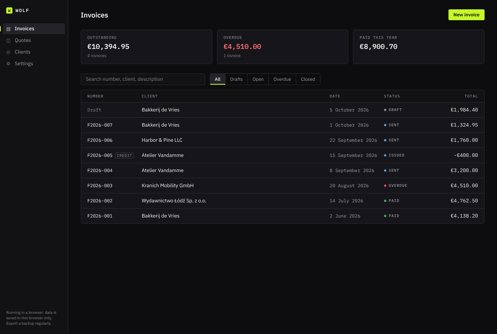
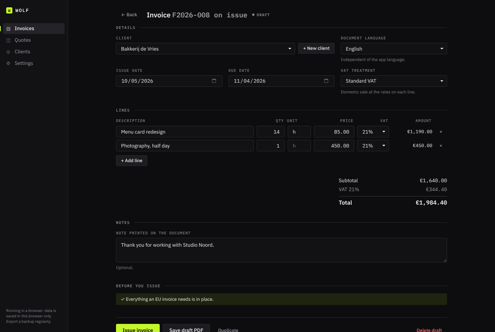
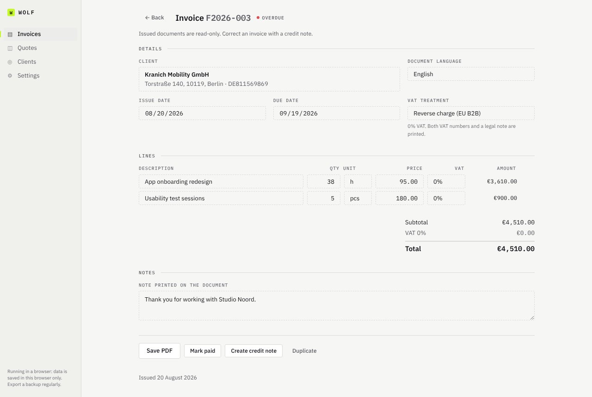
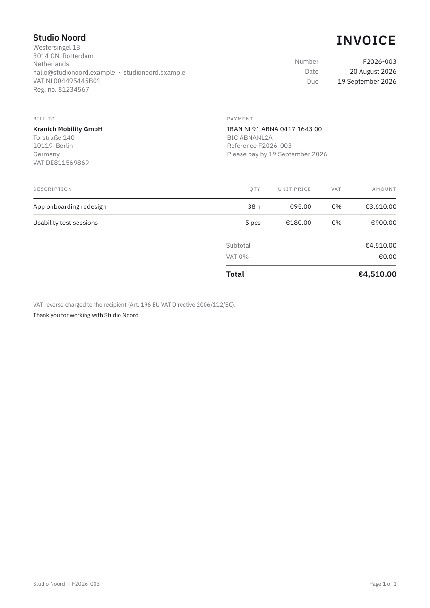
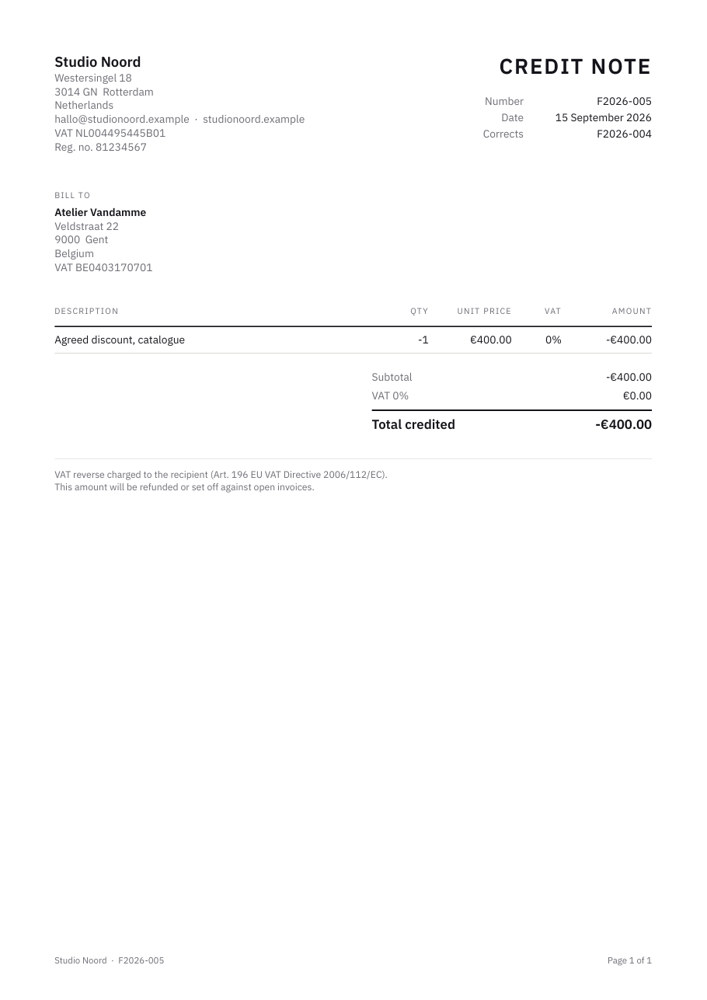

<div align="center">

# Wolf

**EU-compliant invoices, quotes and credit notes for freelancers.**<br>
A desktop app with no account, no server and no subscription. Your data is a file on your own computer.

[](https://github.com/GabrielsProjectskis/wolf/actions/workflows/ci.yml)




</div>

## Why I built it

Freelancers in the EU need invoices that satisfy the VAT Directive: sequential numbers with no gaps, both VAT numbers on cross-border sales, the right legal wording for reverse charge or a small-business exemption, totals that reconcile to the cent. Most tools that get this right are subscription web apps that hold your financial data on their servers.

Wolf does it locally. It works out the VAT treatment from your country and your client's, checks an invoice against the legal requirements before it can be issued, and writes PDFs in English or Dutch. Everything lives in one JSON file in `Documents/Wolf`, which you can back up, sync with any cloud drive, or read with a text editor.

## Features

- **Invoices, quotes and credit notes.** Drafts have no number; issuing assigns the next number in a gapless yearly sequence and locks the document. Mistakes are corrected with a credit note (full or partial), never by editing or deleting.
- **Automatic VAT treatment.** Domestic, intra-EU reverse charge (Art. 196), export outside the EU, or a small-business exemption (KOR). Detected from the two countries and the client's VAT number, always overridable. VAT rates for all 27 member states.
- **Pre-issue checklist.** Before you can issue, Wolf checks the items Article 226 of the VAT Directive requires (VAT numbers, addresses, exemption wording, dates) and explains what's missing. Advisory items (no IBAN, no KVK number) warn without blocking.
- **Quotes become invoices** in one click once accepted.
- **Overview.** Outstanding, overdue and paid-this-year totals per currency, search, and status filters.
- **PDFs** with embedded fonts (so Polish, Czech and Hungarian names print correctly), page numbers, payment reference, and a document language independent of the interface language.
- **English and Dutch** interface, light and dark theme, keyboard accessible, screen-reader labelled.
- **Safe storage.** Atomic writes, the previous save kept as `.bak`, two weeks of daily copies, and recovery from a damaged file without ever overwriting it.

| Writing an invoice                                                               | An issued invoice (light theme)                                                 |
| -------------------------------------------------------------------------------- | ------------------------------------------------------------------------------- |
|  |  |

| The PDF                                                         | A credit note                                            |
| --------------------------------------------------------------- | -------------------------------------------------------- |
|  |  |

Sample PDFs: [reverse-charge invoice](docs/samples/invoice-reverse-charge.pdf), [credit note](docs/samples/credit-note.pdf), [Dutch invoice](docs/samples/factuur-nl.pdf), [multi-page](docs/samples/multi-page.pdf).

## Tech stack

| Layer         | Choice                                                        | Why                                                                                |
| ------------- | ------------------------------------------------------------- | ---------------------------------------------------------------------------------- |
| Desktop shell | [Tauri 2](https://tauri.app) (Rust)                           | A small native app on the system webview, with a capability-based permission model |
| UI            | React 18, TypeScript (strict)                                 | No UI framework; a small hand-written design system in CSS custom properties       |
| PDF           | `@react-pdf/renderer`                                         | Layout in JSX, fonts embedded, runs fully offline                                  |
| Storage       | One JSON file (desktop) or IndexedDB (browser build)          | Behind a single `StorageAdapter` interface                                         |
| Tests         | Vitest, Testing Library, Playwright, pdf.js, WebDriver        | Unit, UI, PDF-content, browser and real-desktop-app tests                          |
| Quality       | ESLint (incl. jsx-a11y), Prettier, GitHub Actions, Dependabot |                                                                                    |

## Engineering decisions

**Money is never a float.** Amounts are integer cents. Input is parsed digit by digit (`"1.234,56"` and `"1,234.56"` both work), and quantity x price and VAT are multiplied in `BigInt` with half-up rounding, so `1.005 h x €1.00` is `€1.01`, not the `€1.00` floating point gives.

**VAT is rounded per rate, not per line.** Seven lines of €14.50 at 21% carry €21.32 VAT when grouped and €21.35 when each line is rounded first. Wolf does what accountants expect.

**Business rules live in pure functions, not screens.** Every change goes through [`src/lib/actions.ts`](src/lib/actions.ts): `issue`, `createCreditNote`, `updateDraft` and so on take the current data and return the next, or throw. An issued invoice can't be edited because `updateDraft` refuses, not because a button is hidden. Issuing assigns the number and advances the counter in one state update, so a double click can't hand out the same number twice.

**Nothing from outside is trusted.** The data file at start-up and any imported backup go through a schema validator ([`src/lib/validate.ts`](src/lib/validate.ts)) that rejects the whole file with a list of reasons rather than half-loading it. It also refuses document numbers that could act as file paths and strips logos that aren't embedded images.

**A damaged data file is never overwritten.** If `data.json` can't be read, Wolf opens the newest readable backup and renames the damaged file aside. If there is no usable backup, it shows a recovery screen and disables saving entirely until you choose what to do.

**Dates are calendar days, not instants.** The first version computed due dates as local midnight printed in UTC, which made every due date in the EU one day early. Date arithmetic now happens in UTC on purpose and is tested in five time zones and across DST changes.

## Security model

Wolf has no network access, no telemetry and no account. The desktop shell is locked down in [`src-tauri/capabilities/default.json`](src-tauri/capabilities/default.json) and [`tauri.conf.json`](src-tauri/tauri.conf.json):

- File access is scoped to `Documents/Wolf` (data, `backups/`, `pdf/`). The desktop smoke test confirms that reading `/etc/passwd` and opening a URL are both refused.
- A strict Content-Security-Policy: scripts only from the app itself, no `eval` (only `wasm-unsafe-eval`, which the PDF layout engine needs), no remote images, fonts or connections.
- No shell plugin, no dialog plugin, no URL opener; the only extra permissions are revealing a file Wolf wrote and closing its own window.
- React escapes everything; a test fails the build if `dangerouslySetInnerHTML`, `eval` or `innerHTML =` appears in the source.

See [SECURITY.md](SECURITY.md) for the reasoning and how to report a problem.

## Getting started

### Try it in a browser (no Rust needed)

```bash
npm install
npm run dev            # http://localhost:1420
```

In the browser build data is kept in IndexedDB. Export a backup from Settings if you want to keep it.

### Run the desktop app

You need [Node.js 20+](https://nodejs.org), [Rust](https://rustup.rs), and the [Tauri prerequisites](https://tauri.app/start/prerequisites/) for your OS (on Windows: the "Desktop development with C++" workload of the Visual C++ Build Tools; on Linux: WebKitGTK).

```bash
npm install
npm run tauri:dev      # opens the Wolf window with hot reload
npm run tauri:build    # installer in src-tauri/target/release/bundle/
```

Desktop data lives in `Documents/Wolf/data.json`. Put the `Wolf` folder in Dropbox, OneDrive or iCloud Drive and you get sync across machines without Wolf holding any of your data.

## Testing

```bash
npm run check          # typecheck, lint, format, all Vitest suites, production build
npm run test:e2e       # Playwright in Chromium and WebKit against the production build
./tests/run-all.sh     # everything, including Rust lint and the desktop smoke test
```

| Suite           | What it covers                                                                                                                                                                                                                                                                            |
| --------------- | ----------------------------------------------------------------------------------------------------------------------------------------------------------------------------------------------------------------------------------------------------------------------------------------- |
| `tests/unit`    | Money parsing and rounding, dates in five time zones, numbering, the document lifecycle and its rules, the pre-issue checklist, totals, file validation, desktop storage against an in-memory file system (including corrupt-file recovery), translations, and the security configuration |
| `tests/ui`      | The app rendered in jsdom and driven like a user: setup, writing and issuing an invoice, confirmations, credit notes, search, client editing, damaged data, backup import, and save timing                                                                                                |
| `tests/pdf`     | Renders real PDFs and reads the text back with pdf.js: required legal content, Polish characters, page numbers on every page, Dutch output, credit notes                                                                                                                                  |
| `tests/e2e`     | The first-run journey in real Chromium and WebKit, under the app's Content-Security-Policy, including PDF download and reload                                                                                                                                                             |
| `tests/desktop` | The compiled desktop app in its real WebKitGTK webview, driven over WebDriver: data and backups on disk, PDF written through the file-system scope, permission denials, and closing the window                                                                                            |

The end-to-end and desktop tests have each caught bugs the faster suites couldn't: a `select-on-focus` that the browser undid on mouse-up (so typing `7,5` into a quantity gave `7,51`), and a hardening flag (`freezePrototype`) that broke PDF generation inside the desktop webview.

## Project layout

```
src/
  lib/actions.ts        Every state change, as pure functions. The business rules.
  lib/checklist.ts      Pre-issue legal checks (Art. 226 EU VAT Directive).
  lib/money.ts          Parsing, rounding and totals in integer cents.
  lib/dates.ts          Calendar-day arithmetic, time-zone safe.
  lib/document.ts       VAT treatment detection, balances, display status.
  lib/numbering.ts      Gapless yearly sequences.
  lib/validate.ts       Schema validation for data files and backups.
  lib/pdf.tsx           The A4 template.
  storage/              StorageAdapter + desktop file and browser IndexedDB backends.
  store/store.tsx       State, serialised autosave, flush on close, recovery state.
  screens/              Setup, Recovery, DocumentList, DocumentEditor, Clients, Settings.
  components/           Form primitives, dialog, toasts, business and client forms.
  i18n/strings.ts       English and Dutch. A missing Dutch string is a compile error.
  data/eu.ts            VAT rates, currencies and VAT prefixes for the 27 member states.
src-tauri/              Rust shell, window config, capabilities, icons.
tests/                  unit, ui, pdf, e2e, desktop (see above).
```

## Releasing

Push a tag and GitHub Actions builds installers for Windows and both macOS architectures (no Mac needed):

```bash
git tag v1.0.0 && git push origin v1.0.0
```

The builds are unsigned. Windows shows a SmartScreen prompt ("More info", then "Run anyway"); macOS needs the $99/year Apple Developer Program for notarisation, and the secrets are ready to uncomment in [`release.yml`](.github/workflows/release.yml). Keep the `@tauri-apps/*` npm packages and the Rust crates on the same minor version; the build refuses to run otherwise.

## Limitations and roadmap

- VAT numbers are checked for format, not against the EU VIES service, because that would send client data to a server. An opt-in check is a candidate.
- No recurring invoices, expense tracking, or payment links.
- Interface languages: English and Dutch. Adding one is a single typed object in `src/i18n/strings.ts`.
- VAT rates are reference data (reviewed October 2026). They seed the rate picker; Wolf is not tax advice.

## License

[MIT](LICENSE) © 2026 Gabriel Jukema
